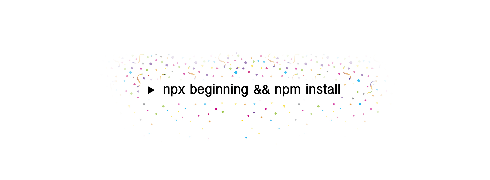

<h1 align="center">Webpack/Babel/TypeScript/React/ESLint</h1>

A small starter kit for your JavaScript/React projects. It includes:

* Webpack + webpack-dev-server (live-reload and watcher)
* TypeScript
* React + styled-components
* ESLint/Prettier configured

## How to use it

1. Create an empty folder and run `npx beginning && npm install`
2. Run `npm run dev` and open http://localhost:9000

--- 

* To use just bundling and watching use `npm run watch`.
* To generate a production ready bundle use `npm run build`.

## Why you may need this

* You don't wanna deal with Webpack/Babel/TypeScript/React configuration.
* You want the bare minimum setup to work with TypeScript and React.
